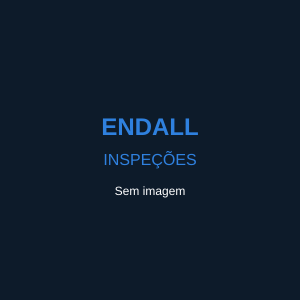

# 🖼️ CORREÇÃO: Imagens dos Produtos

## ❌ PROBLEMA IDENTIFICADO

As imagens dos produtos **não aparecem** porque:
1. ✅ O banco de dados está usando URLs externas do `via.placeholder.com`
2. ✅ Essas URLs externas não carregam (sem internet ou bloqueadas)
3. ✅ É necessário usar imagens locais

---

## ✅ SOLUÇÃO APLICADA

### 1️⃣ **Imagem Local Criada**
- ✅ Arquivo: `assets/images/produto-sem-foto.svg`
- ✅ Imagem placeholder local já existe no projeto

### 2️⃣ **Código PHP Corrigido**
- ✅ `index.php` - atualizado para usar imagem local como fallback
- ✅ `produto.php` - atualizado para usar imagem local como fallback
- ✅ Todas as tags `` agora têm `onerror="this.src='assets/images/produto-sem-foto.svg'"`

### 3️⃣ **Script SQL para Atualizar Banco de Dados**
- ✅ Criado: `install/atualizar-imagens-locais.sql`
- ✅ Substitui todas as URLs externas pela imagem local

---

## 🚀 COMO APLICAR A CORREÇÃO

### **PASSO 1: Executar o Script SQL**

Acesse o banco de dados e execute:

```bash
# Pelo terminal MySQL
mysql -u root -proot endall_vendas < install/atualizar-imagens-locais.sql

# OU pelo phpMyAdmin
# 1. Acesse http://localhost/phpmyadmin
# 2. Selecione o banco "endall_vendas"
# 3. Vá na aba "SQL"
# 4. Copie e cole o conteúdo de install/atualizar-imagens-locais.sql
# 5. Clique em "Executar"
```

**OU execute manualmente no phpMyAdmin:**

```sql
UPDATE produtos 
SET imagens = '["assets/images/produto-sem-foto.svg"]'
WHERE ativo = 1;
```

---

### **PASSO 2: Limpar Cache do Navegador**

1. Pressione **Ctrl + Shift + Delete** (ou Cmd + Shift + Delete no Mac)
2. Selecione "Imagens e arquivos em cache"
3. Clique em "Limpar dados"
4. **OU** simplesmente pressione **Ctrl + Shift + R** (hard refresh)

---

### **PASSO 3: Testar**

Acesse:
- **Catálogo**: http://localhost:8888/Endall/catalogo/projeto/index.php
- **Produto Individual**: http://localhost:8888/Endall/catalogo/projeto/produto.php?id=1

**Resultado Esperado:**
- ✅ Todos os produtos exibem a imagem placeholder local (ícone de câmera SVG)
- ✅ Não há mais imagens quebradas ou carregando de URLs externas
- ✅ A página carrega instantaneamente sem depender de conexão externa

---

## 📸 ADICIONAR IMAGENS REAIS DOS PRODUTOS (OPCIONAL)

Se você tiver imagens reais dos produtos, siga estes passos:

### **1. Preparar as Imagens**
- Tamanho recomendado: 800x600px (ou proporção similar)
- Formato: JPG ou PNG
- Nomeie como: `produto-[SKU].jpg` (ex: `produto-MV6-1.jpg`)

### **2. Upload das Imagens**
- Coloque as imagens na pasta: `uploads/produtos/`

### **3. Atualizar o Banco de Dados**

```sql
-- Exemplo para atualizar imagem de um produto específico
UPDATE produtos 
SET imagens = '["uploads/produtos/produto-MV6-1.jpg"]'
WHERE sku = 'MV6-1';

-- Para produtos com múltiplas imagens
UPDATE produtos 
SET imagens = '["uploads/produtos/produto-MV6-1-1.jpg", "uploads/produtos/produto-MV6-1-2.jpg", "uploads/produtos/produto-MV6-1-3.jpg"]'
WHERE sku = 'MV6-1';
```

---

## 🔧 ALTERAÇÕES TÉCNICAS REALIZADAS

### **1. index.php (Linha 243-254)**

**ANTES:**
```php
$primeira_imagem = !empty($imagens) ? $imagens[0] : '';
```

**DEPOIS:**
```php
$primeira_imagem = !empty($imagens) ? $imagens[0] : 'assets/images/produto-sem-foto.svg';
// Se a imagem estiver vazia ou for inválida, usar placeholder local
if (empty($primeira_imagem)) {
    $primeira_imagem = 'assets/images/produto-sem-foto.svg';
}
```

**E no HTML:**
```html
" 
     alt="<?= htmlspecialchars($produto['nome']) ?>" 
     class="produto-image"
     onerror="this.src='assets/images/produto-sem-foto.svg'">
```

### **2. produto.php (Linha 106-114)**

**ANTES:**
```php
/images/produto-sem-foto.jpg"
```

**DEPOIS:**
```php

```

---

## ✅ CHECKLIST DE VERIFICAÇÃO

Após aplicar a correção, verifique:

- [ ] Script SQL executado com sucesso
- [ ] Cache do navegador limpo
- [ ] Catálogo carrega e exibe imagens placeholder
- [ ] Página de produto individual exibe imagem
- [ ] Carrinho de orçamento exibe imagens dos produtos
- [ ] Formulário de orçamento exibe imagens dos produtos selecionados

---

## 📊 STATUS ATUAL

| Item | Status | Descrição |
|------|--------|-----------|
| **Imagem local SVG** | ✅ Criada | `assets/images/produto-sem-foto.svg` |
| **Código PHP** | ✅ Corrigido | `index.php`, `produto.php` com fallback |
| **Script SQL** | ✅ Pronto | `install/atualizar-imagens-locais.sql` |
| **Banco de dados** | ⏳ Aguardando | Executar script SQL |
| **Teste visual** | ⏳ Aguardando | Após executar SQL e limpar cache |

---

## 🆘 RESOLUÇÃO DE PROBLEMAS

### **Imagens ainda não aparecem após a correção?**

1. **Verifique se o script SQL foi executado:**
   ```sql
   SELECT id, sku, imagens FROM produtos LIMIT 5;
   ```
   Deve retornar algo como: `["assets/images/produto-sem-foto.svg"]`

2. **Verifique se o arquivo SVG existe:**
   - Caminho: `assets/images/produto-sem-foto.svg`
   - Deve ter 528 bytes

3. **Limpe o cache novamente:**
   - Pressione **Ctrl + Shift + R** (hard refresh)

4. **Verifique o console do navegador (F12):**
   - Procure por erros 404 ou de carregamento
   - Se houver erro, verifique o caminho da imagem

5. **Teste diretamente a imagem:**
   - Acesse: `http://localhost:8888/Endall/catalogo/projeto/assets/images/produto-sem-foto.svg`
   - Deve exibir a imagem SVG

---

## 📝 PRÓXIMOS PASSOS

Após corrigir as imagens:

1. ✅ Executar script SQL
2. ✅ Limpar cache do navegador
3. ✅ Testar catálogo e página de produto
4. ⏳ **Adicionar imagens reais dos produtos** (quando disponíveis)
5. ⏳ **Implementar geração de PDF** com as imagens
6. ⏳ **Criar painel administrativo** para upload de imagens

---

## 🎯 RESULTADO ESPERADO

✅ **Todas as páginas exibem imagens corretamente**
✅ **Sistema não depende mais de URLs externas**
✅ **Carregamento instantâneo das imagens**
✅ **Base pronta para adicionar imagens reais**

---

**Data da Correção**: 2026-03-12  
**Arquivos Modificados**:
- `index.php`
- `produto.php`
- `install/atualizar-imagens-locais.sql` (criado)
- `CORRECAO-IMAGENS.md` (este arquivo)

---

**🔗 LINKS ÚTEIS:**
- Catálogo: http://localhost:8888/Endall/catalogo/projeto/index.php
- Produto: http://localhost:8888/Endall/catalogo/projeto/produto.php?id=1
- Orçamento: http://localhost:8888/Endall/catalogo/projeto/orcamento.php
